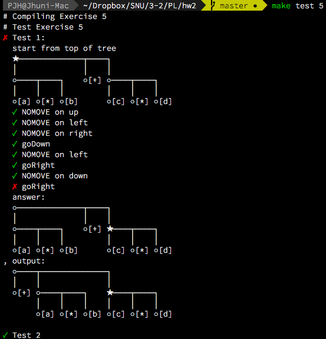

# pl-checker
> 2017F Programming Language Homework Checker

# HOW TO USE
```bash
git clone https://github.com/Jhuni0123/pl-checker.git
cd pl-checker
cd hw1
# write ex1.ml, ex2.ml, ... ex4.ml
make test 1 # check exercise 1
make        # check every exercise
```
you should write `hw<hwnum>/ex<exnum>.ml` for test \<hwnum>-\<exnum>
- `make test <exnum>` (= `./check.sh <exnum>`): complile exercise \<exnum> and run test, and show results of every testcase
- `make` (= `./check.sh`): compile every exercise in current hw folder (hw\<hwnum>), run test, and show summary

# HOW TO UPDATE
```bash
git pull origin master
```

# Status
- HW 3~ : TBD

# Screenshot
### 2-5: Zip-Zip Tree


---
[MIT License](LICENSE)
